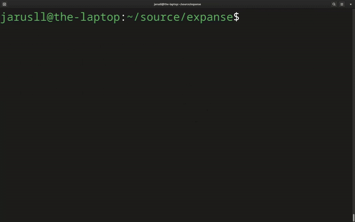

# Keydogger



A keyboard macro based on [wl-clipboard](https://github.com/bugaevc/wl-clipboard).

# Working
If all the expanded characters are ascii, key presses are sent. If not, `Ctrl-V` is sent.

# Prerequisites
- `wl-clipboard`
- `gcc`
- `make`

# Installation
```bash
git clone https://github.com/jarusll/keydogger.git
cd keydogger
```

Configure `KEYBOARD_EVENT_PATH` in `Makefile`. Can use `evtest` to find out keyboard input device.

To install, run the following as sudo
```bash
make clean install
```

# Testing
You can play with macros using the local `keydoggerrc` file by
```bash
make clean build
sudo ./keydogger debug
```

# Configuration
Set trigger and expansion values in `~/keydoggerrc`
```
@hello=world
:kiss:=😙
@truth=Open source is nice and Keydogger can inject this line as keypresses.
```

# Acknowledgements
- [emisilve86](https://github.com/emisilve86/Keylogger-Daemon-Linux) for their code
- [Espanso](https://github.com/federico-terzi/espanso) for the `1000` microseconds of delay between events

# TODO
## v1
- [x] Daemonize it
- [x] Use `/dev/uinput` to emit events
- [x] Read trigger & expansions from `.keydoggerrc`
## v2
- [x] Unicode support
